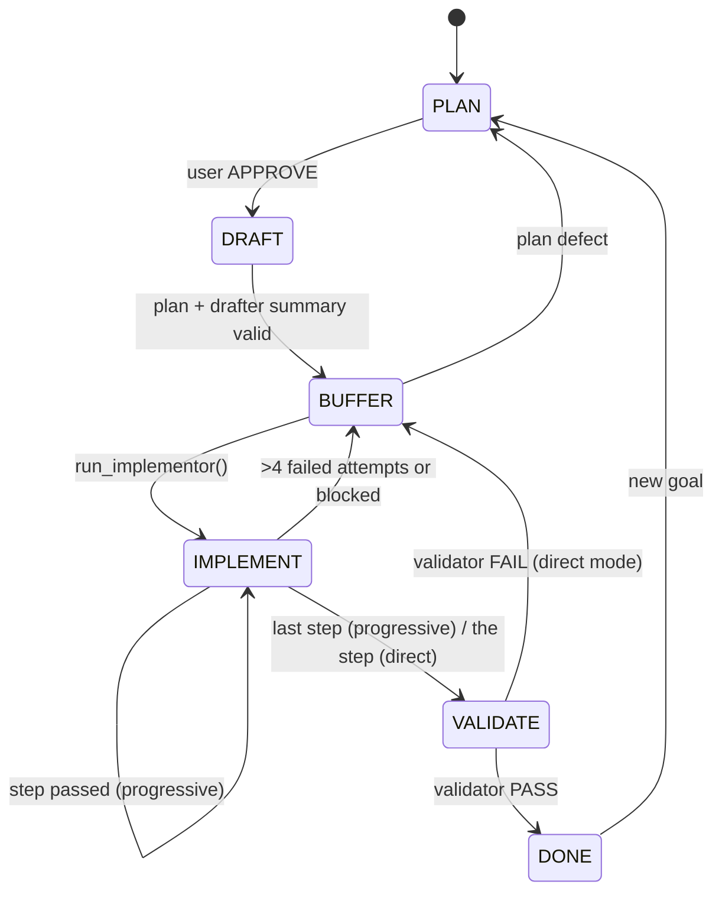

# agent: director/implementor workflow

Claude Code plans, drafts and validates. A pluggable **implementor** executes
small, fully specified steps. The workflow is a state machine enforced in
`server.py`, not by prompts.

## State Machine



- The director hands over by calling the blocking `run_implementor()`; control
returns as one `HANDOFF` line. Progressive mode runs all remaining steps,
direct mode only `pointer`.
- After each step the server runs its TEST, then commits. Failure after
4 attempts (or `blocked()`) writes a checkpoint and returns to BUFFER; after
2 director fixes on one step it halts for you (`user_guided=true`).
- Every stage starts fresh and reads the previous stage's summary. The server
requires the drafter's `handoff/draft.md` before BUFFER and the validator's
`handoff/validate.md` (`PASS run=<k>` / `FAIL step=<n> run=<k>`) before DONE
or a fix round, and rejects a stale or contradicting verdict. Plans are
hash-locked after DRAFT; test files are `LOCK`ed.
- Not enforced: `APPROVE` before DRAFT, and that subagents really start
fresh (an MCP server can't reset Claude Code's context).

## Repo layout

```
agent/
├── common/{style,protocol,discussion}.md        # tone, FSM, PLAN dialogue
├── director/{director.md, agents/, commands/}   # router prompt; drafter, unblocker, validator; /agent
├── implementor/implementor.md                   # implementor role and tool contract
├── hooks/session_start.sh                       # resumes a workflow; silent in the headless implementor
├── server.py                                    # FSM, MCP tools, both backends
└── tests/  requirements.txt  pytest.ini
```

## Implementor backends

Chosen by `AGENT_IMPLEMENTOR`, with one model setting `AGENT_MODEL`, both
read at server start. No tool, argument or prompt can change them.
`fsm_status` shows `implementor=<backend>:<model>`; `run_implementor()`
refuses, changing nothing, if the backend can't run.

| `AGENT_IMPLEMENTOR` | Implementor | `AGENT_MODEL` |
|---|---|---|
| `ollama` (default) | local model, new chat per step | Ollama tag, default `qwen3:8b` |
| `claude` | headless Claude Code session (`claude -p`), new process per attempt | Claude Code alias or name, required |

```bash
claude                                              # ollama + qwen3:8b
AGENT_IMPLEMENTOR=claude AGENT_MODEL=haiku claude   # Claude Code implements
```

Both get the same tools (`read_file`, `write_file`, `run`, `delete_path`,
`finish_step`, `blocked`), sandboxed to the project: `run` is allowlisted
with secrets scrubbed, and `delete_path` never touches `.git` or `.agent`
and never follows symlinks. Steps are committed by the server as
`agent-implementor <agent@localhost>`, unsigned, hooks off (`AGENT_GIT_NAME`/`AGENT_GIT_EMAIL`);
commit failures are reported but never block. Start from a clean
tree with a `.gitignore`.

- **`ollama`:** `AGENT_THINK=1` logs the model's thinking; `AGENT_STREAM=0`
disables live streaming.
- **`claude`:** uses your Claude Code login, no API key. Tools come from
`python server.py --impl-tools`; the session runs with `--strict-mcp-config --tools ""`,
and its `init` event is checked in code. Any built-in tool, other MCP
server, or model not matching `AGENT_MODEL` kills it before it acts.
A retry gets the last failure; timeout 30 min.
  - Model names: `/model` lists what your plan offers; an alias follows what
  it maps to, so pin a full name (`claude-sonnet-5-5`). Check one with
    `claude -p --model claude-sonnet-5-5 --output-format stream-json --verbose "ok" | head -n 1`
  - Unverified against a live `claude`: flags and the `init` layout come
  from the docs; tests use `tests/fake_claude.py`. The check fails closed.

## Usage

**Install** (Python 3.13, git, Claude Code; Ollama for the `ollama` backend):

```bash
cd ~/personal/agent
python3 -m venv venv && ./venv/bin/pip install -r requirements.txt     # keep mcp<2
mkdir -p ~/.claude/agents ~/.claude/commands
ln -sf $PWD/director/agents/*.md ~/.claude/agents/
ln -sf $PWD/director/commands/agent.md ~/.claude/commands/agent.md
claude mcp add --scope user agent -- $PWD/venv/bin/python $PWD/server.py
chmod +x hooks/session_start.sh && ./venv/bin/pytest -q tests/test_install.py
```

`~/.claude/settings.json` (merge; only `Edit()` deny rules are matched,
`MCP_TOOL_TIMEOUT` is in ms and must be long because `run_implementor()`
blocks, verify both against current docs):

```json
{
  "env": { "MCP_TOOL_TIMEOUT": "14400000" },
  "permissions": {
    "allow": ["mcp__agent__fsm_status", "mcp__agent__fsm_to", "mcp__agent__run_implementor"],
    "deny": ["Edit(**/.agent/state.json)"],
    "additionalDirectories": ["~/personal/agent"]
  },
  "hooks": { "SessionStart": [ { "hooks": [ { "type": "command", "command": "/home/<you>/personal/agent/hooks/session_start.sh" } ] } ] }
}
```

**Per project** (once): `git init`, add an `AGENTS.md` (test command,
layout, conventions; use `python3`), ignore `.agent/state.json`,
`.agent/attempts/`, `.agent/checkpoint.md`, `.agent/run.log`, commit.

**Per session:** run `claude` in the project, `/agent <goal>`, answer
the questions, reply `APPROVE`. It then runs by itself and comes
back at the end or at a halt. `.agent/` is relative to where you launch `claude`.

- **Watch:** the director shows `run_implementor()` collapsed, so
tail the live log in a second pane: `tmux new-session 'claude' \; split-window -h 'tail -n 40 -F .agent/run.log'`.
Claude sessions log `[session] <id>`; `claude --resume <id>` shows
the transcript afterwards (unverified).
- **Resume:** restart `claude`; the hook resumes from `.agent/`.
`/clear` after approval gives a fresh director context.
- **Stop:** exit `claude` or `pkill -f personal/agent/server.py`;
a stale `IMPLEMENT` returns to `BUFFER`. **Abandon:** `rm -rf .agent && git reset --hard`.

## Tests

```bash
./venv/bin/pytest -q                                      # everything except live tests
LIVE=1 ./venv/bin/pytest -q tests/test_live_qwen.py -s    # real Ollama, non-deterministic
```

`test_edges` (transitions, plan gating), `test_loop` (implementor loop,
sandbox), `test_fuzz` (random operations), `test_tools_git`,
`test_observability`, `test_backends` (backend selection, headless Claude
session via `fake_claude.py`), `test_handoff`, `test_prompts` (prompts
vs server), `test_install` (real `~/.claude*` wiring). Run them before
each live run, and add a test with any change to a prompt or `server.py`.
