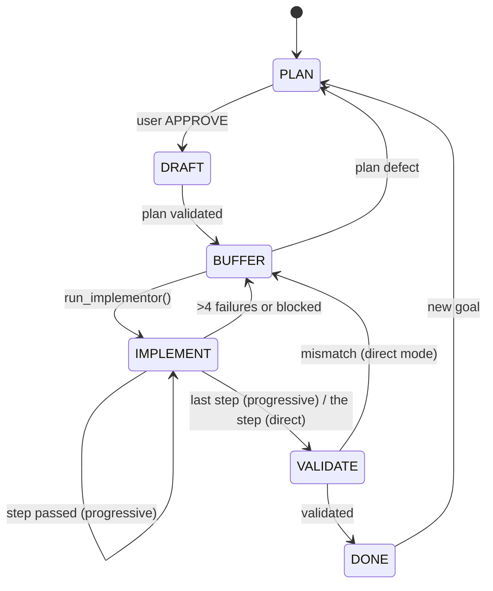

# agent: director/implementor agentic workflow

A system-wide, git-tracked workflow where **Claude Code is the director** (thinks, plans, reviews) and a **local Ollama model (`qwen3.5:9b`) is the implementor** (executes one small step at a time, exactly as written, no design of its own).

Goals: minimise director tokens, be precise about what each agent is told, and behave as a strict finite state machine. Transitions are enforced in code (`server.py`), not by prompts.

## Contents

- [How it works](#how-it-works)
- [Repo layout](#repo-layout)
- [Install](#install)
- [Using it in a project](#using-it-in-a-project)
- [Phases](#phases)
- [Step file format](#step-file-format)
- [Runtime files](#runtime-files)
- [What is enforced vs advisory](#what-is-enforced-vs-advisory)
- [Configuration](#configuration)
- [Tests](#tests)
- [Troubleshooting](#troubleshooting)
- [Changing the prompts or server](#changing-the-prompts-or-server)

## How it works



| Edge | Actor | Condition (checked by the server) |
|---|---|---|
| NONE→PLAN | director | project is a git repo, not `~` |
| PLAN→DRAFT | director | `plan/summary.md` exists and is non-empty |
| DRAFT→BUFFER | director | every step file well-formed, under the size cap, has a TEST block; plan hash recorded |
| BUFFER→IMPLEMENT | director | plan hash unchanged; directive present if required; not halted |
| IMPLEMENT→IMPLEMENT | implementor | step's TEST passed; progressive mode; more steps |
| IMPLEMENT→BUFFER | implementor | more than 4 failed attempts, or `blocked()` |
| IMPLEMENT→VALIDATE | implementor | progressive: last step passed. direct: the one step passed |
| VALIDATE→BUFFER | director | `pointer=n`, `mode='direct'`, `directive.md` written |
| VALIDATE→DONE | director | |
| DONE→PLAN, BUFFER→PLAN | director | archives the old plan; keeps `summary.md` for revision |

Any other move is refused. `BUFFER→PLAN` is an addition to the original spec, for plan defects. Delete that line from `EDGES` to forbid it.

### Control passing

- **Director → implementor:** the director calls the MCP tool `run_implementor()`, which blocks.
- **Implementor → director:** the call returns one `HANDOFF implementor->director ...` line.
- **Fresh contexts:**
  - Claude: DRAFT, escalation fixes and VALIDATE run as subagents (`drafter`, `unblocker`, `validator`). The main thread only routes and runs PLAN.
  - Qwen: a new chat for every step.
- **State lives on disk** (`.agent/state.json`), so any session can be cleared or restarted and resume from the recorded phase.

## Repo layout

```
agent/
├── common/
│   ├── style.md         # tone, honesty, response types (director AND implementor)
│   ├── protocol.md      # FSM + file layout (director)
│   └── discussion.md    # PLAN-phase dialogue rules (director <-> user)
├── director/
│   ├── director.md      # router loop; director-only rules
│   ├── agents/          # drafter.md, unblocker.md, validator.md  (symlinked into ~/.claude/agents)
│   └── commands/agent.md  # /agent slash command (symlinked into ~/.claude/commands)
├── implementor/implementor.md   # Qwen's role and tool contract
├── hooks/session_start.sh       # injects "workflow active" into Claude when .agent/state.json exists
├── server.py            # FSM + MCP tools (director) + implementor runtime (Ollama tool loop)
├── tests/               # pytest suite (see Tests)
├── requirements.txt     # mcp[cli]<2, ollama, pytest
└── pytest.ini
```

What each agent loads:

| Agent | Loads |
|---|---|
| Director (Claude Code) | `common/style.md`, `common/protocol.md`, `director/director.md`; `common/discussion.md` only during PLAN |
| Subagents | their own file in `director/agents/`, plus `style.md` and the plan files |
| Implementor (Qwen) | `common/style.md` + `implementor/implementor.md` + the current step + the project's `AGENTS.md` (first 3000 chars). It gets no FSM text; the server enforces it |

## Install

Prerequisites: Debian-like Linux, Python 3.13, git, Claude Code (CLI), Ollama running with `qwen3.5:9b` pulled and tool support.

```bash
cd ~/personal/agent
python3 -m venv venv
./venv/bin/pip install -r requirements.txt     # keep mcp pinned below 2; FastMCP was renamed in 2.x

# 1) Claude Code wiring
mkdir -p ~/.claude/agents ~/.claude/commands
ln -sf $PWD/director/agents/*.md ~/.claude/agents/
ln -sf $PWD/director/commands/agent.md ~/.claude/commands/agent.md
claude mcp add --scope user agent -- $PWD/venv/bin/python $PWD/server.py

# 2) hook (deterministic pickup of an existing workflow)
chmod +x hooks/session_start.sh
```

`hooks/session_start.sh`:

```bash
#!/usr/bin/env bash
d="${CLAUDE_PROJECT_DIR:-$PWD}"
[ -f "$d/.agent/state.json" ] && echo "Agent workflow active in $d. Call fsm_status, then follow ~/personal/agent/director/director.md."
exit 0
```

`~/.claude/settings.json` (merge with what you have):

```json
{
  "env": { "MCP_TOOL_TIMEOUT": "14400000" },
  "permissions": {
    "allow": ["mcp__agent__fsm_status", "mcp__agent__fsm_to", "mcp__agent__run_implementor"],
    "deny": ["Edit(**/.agent/state.json)"],
    "additionalDirectories": ["~/personal/agent"]
  },
  "hooks": {
    "SessionStart": [
      { "hooks": [ { "type": "command", "command": "/home/<you>/personal/agent/hooks/session_start.sh" } ] }
    ]
  }
}
```

Notes:

- Only `Edit(...)` deny rules are matched. A `Write(...)` rule is rejected with a warning.
- `MCP_TOOL_TIMEOUT` is in milliseconds. It must be long, because `run_implementor()` blocks while Qwen works. Check the name and unit against current Claude Code docs.
- Ollama: the first step pays a cold model load. To keep the model resident, preload with `curl -s localhost:11434/api/generate -d '{"model":"qwen3.5:9b","keep_alive":"30m"}'`. The server also passes `keep_alive="30m"`.

Verify the install:

```bash
./venv/bin/pytest -q tests/test_install.py
```

## Using it in a project

### Once per project

```bash
cd ~/personal/<project>
git init                                  # required: the server refuses PLAN outside a git repo
cat > AGENTS.md <<'EOF'
# Project facts
- Test: `pytest -q`
- Layout: src/, tests/
- Conventions: type hints; no new deps without approval
EOF
printf '.agent/state.json\n.agent/attempts/\n.agent/checkpoint.md\n.agent/run.log\n' >> .gitignore
git add -A && git commit -m init          # clean baseline so diffs are readable
```

`AGENTS.md` is read by the implementor and by the subagents. Claude Code itself reads `CLAUDE.md`, not `AGENTS.md`. Add a `CLAUDE.md` containing `@AGENTS.md` only if you want ordinary Claude sessions in that repo to see the same facts. Use `python3` in test commands (Debian has no `python`).

`.agent/` is relative to the directory you launch `claude` from. The server uses the same rule (`$AGENT_PROJECT` overrides it).

### Each session

1. Make sure Ollama is running.
2. Run `claude` in the project directory. `/mcp` should show `agent`, and `/agents` the three subagents.
3. `/agent <goal>`. The director asks one question per message until nothing is ambiguous, then writes `.agent/plan/summary.md`.
4. Reply `APPROVE` (or list changes).
5. It then runs by itself: draft the plan, hand off to Qwen, validate. You hear back at the end, or if an escalation hits the limit and needs your guidance.

Watch it from another terminal:

```bash
tail -f .agent/run.log          # Qwen's tool calls
watch -n2 cat .agent/state.json
git diff --stat
```

### Stop, resume, reset

- **Pause:** exit `claude`. Starting it again in that directory resumes at the recorded phase (the hook points Claude at `fsm_status`).
- **Hard stop mid-implementation:** exit `claude` or `pkill -f personal/agent/server.py`. The next `fsm_status` moves a stale `IMPLEMENT` back to `BUFFER`; then re-run. After a kill you may need `/mcp` to reconnect.
- **New goal:** `/agent <goal>` once the phase is `DONE`. The old plan is archived under `.agent/archive/`.
- **Abandon:** `rm -rf .agent` and `git reset --hard` to your baseline commit.

## Phases

1. **PLAN** (director + you). Rules in `common/discussion.md`: one question per message, options with a recommendation, assumptions stated, nothing coded. Output: `summary.md` (goal, decisions with short reasons, ordered milestones, how each is tested, out of scope, no open items). Only an explicit `APPROVE` moves on. The server cannot verify your consent; that rule lives in the prompts.
2. **DRAFT** (`drafter` subagent, fresh context). Turns the summary into small, ordered step files. The drafter also writes the test files into the project and lists them in `LOCK`, so Qwen cannot weaken them.
3. **BUFFER.** Pure handoff: the director calls `run_implementor()`. The plan is hash-locked and cannot change here. After an escalation, the `unblocker` subagent writes `.agent/directive.md`, which is injected into Qwen's next attempt at that step.
4. **IMPLEMENT** (Qwen). Per step, in a fresh context: read, edit, `finish_step`. The server runs the step's TEST commands. Pass means advance. A failed attempt feeds the output back to Qwen. More than 4 failed attempts (or `blocked()`) writes a checkpoint and returns to BUFFER.
   - A text-only reply from Qwen counts as an implicit `finish_step`.
   - Progressive mode runs all remaining steps. Direct mode runs only `pointer`, then goes to VALIDATE.
5. **VALIDATE** (`validator` subagent, fresh context). Runs every TEST plus the project's full test command and checks the code against the plan. `PASS` goes to DONE with a final summary. `FAIL step=n` writes a directive for that step and returns to BUFFER in direct mode.

After 2 director fixes on the same step the server halts. The director must consult you, then call `run_implementor(user_guided=true)`.

## Step file format

`.agent/plan/NN.md`, at most 1800 characters. The server rejects anything that deviates.

````
GOAL: <one line>
FILES: <path (new|edit)>, ...
DO:
1. <imperative, one line>
(at most 8 lines; say WHAT, not HOW)
TEST:
```
<one command per line; no pipes or shell operators>
```
EXPECT: <one line>
LOCK: <files the implementor must not modify; optional>
````

Test commands are split with `shlex` and run without a shell, from the project root.

## Runtime files

In each project, under `.agent/`:

| Path | Written by | Purpose |
|---|---|---|
| `state.json` | server only | phase, mode, pointer, total, attempts, escalations, halted, plan hash |
| `plan/summary.md` | director | agreed plan and decisions |
| `plan/index.md`, `plan/NN.md` | drafter | step files (immutable after DRAFT) |
| `directive.md` | unblocker / validator | fix instructions for the implementor, deleted after the step passes |
| `checkpoint.md` | server (Qwen summary + log) | why a step escalated |
| `attempts/NN.log` | server | one entry per failed attempt |
| `run.log` | server | trace of Qwen's tool calls |
| `archive/<timestamp>/` | server | previous plans |

## What is enforced vs advisory

**Enforced by `server.py`:**

- Legal transitions, per actor.
- Plan structure, size and presence of tests.
- Plan immutability after DRAFT (hash).
- `directive.md` required after an escalation.
- Escalation limits.
- Tests are run by the server, not trusted from Qwen.
- Locked files must be unmodified.
- Qwen's tools are sandboxed: paths cannot escape the project, `.agent/` is read-only, and `run` is allowlisted.

**Advisory (prompts only):**

- The `APPROVE` requirement before DRAFT.
- Tone and message types.
- What the director delegates to subagents.

`settings.json` permissions and hooks are the hard limits on the Claude side. The `ALLOW` list is hygiene, not a sandbox: `python3` can do anything.

## Configuration

Constants at the top of `server.py`:

| Name | Default | Meaning |
|---|---|---|
| `MODEL` | `qwen3.5:9b` | override with `AGENT_MODEL` |
| `NUM_CTX` | 32768 | check `ollama ps` shows 100% GPU; lower it if it spills to CPU |
| `MAX_ATTEMPTS` | 4 | escalate when failed verifications exceed this (the 5th failure) |
| `MAX_ESCALATIONS` | 2 | director fixes per step before the user must be consulted |
| `MAX_TOOL_CALLS` | 40 | tool calls per attempt before it counts as failed |
| `STEP_CHAR_CAP` | 1800 | max step file size |
| `ALLOW` | pytest, python, python3, ruff, make, cargo, npm, go, ls, cat, grep | commands Qwen's `run` may execute |

Environment: `AGENT_PROJECT` (project root, default cwd), `AGENT_MODEL`.

MCP tools (director): `fsm_status()`, `fsm_to(phase, pointer, mode)`, `run_implementor(user_guided)`.
Qwen's tools: `read_file`, `write_file`, `run`, `finish_step`, `blocked`.

## Tests

```bash
./venv/bin/pytest -q                                      # everything except live tests
./venv/bin/pytest -q tests/test_install.py                # wiring: MCP, settings, hook, symlinks, stdio boot
LIVE=1 ./venv/bin/pytest -q tests/test_live_qwen.py -s    # real Ollama; non-deterministic
```

| File | Covers |
|---|---|
| `test_edges.py` | edge table and actor enforcement, plan validation, plan immutability, lifecycle, archiving |
| `test_loop.py` | implementor loop with a scripted fake model: attempts, escalation, blocked, directives, halting, locks, sandbox, prompt scope and size |
| `test_fuzz.py` | random director/implementor operations; phase changes must only occur through `move()`, in order |
| `test_prompts.py` | prompts vs server: legal transitions in `director.md`, subagent names and frontmatter, drafter template accepted by the server |
| `test_install.py` | real `~/.claude.json` and `settings.json`, hook behaviour, symlinks, an actual MCP boot |
| `test_live_qwen.py` | real Qwen; single step, two dependent steps, impossible step must escalate |

Run the suite before each live run. Use `--basetemp=/tmp/live` to get a predictable `.agent/` path to tail.

## Troubleshooting

| Symptom | Cause / fix |
|---|---|
| `/mcp` reconnect: `CONNECTION_CLOSED` | the server crashed at startup. Run `./venv/bin/python server.py` to see the traceback. If it mentions `FastMCP` or `mcp.server.mcpserver`, you have mcp 2.x: `pip install "mcp[cli]<2"` |
| Warning: `Write(...)` deny rule not matched | use `Edit(**/.agent/state.json)` only |
| `refused: run inside a git repo` | `git init` in the project; the server won't create `.agent/` in `~` or a non-repo |
| `refused: plan files changed since DRAFT` | something edited `.agent/plan/`. Plans are immutable after DRAFT. Re-plan via `fsm_to('PLAN')` |
| `refused: directive.md missing` | the director must have the `unblocker` write one before `run_implementor()` |
| `refused: escalation limit` | ask the user for guidance, then `run_implementor(user_guided=true)` |
| Step escalates immediately, `FakeChat`-like repeats of "tool-call budget exhausted" | check `.agent/attempts/NN.log` and `run.log` for Qwen's last replies. A model that finishes in prose is handled as an implicit `finish_step`, so this is usually a model or step-wording problem |
| Qwen's `run` says `denied` | the command isn't in `ALLOW`; use `python3`, not `python`, on Debian |
| Very slow first step | cold model load; preload with the `keep_alive` call above, check `ollama ps` |
| Ollama reachable from the LAN | `OLLAMA_HOST=0.0.0.0` binds all interfaces; use `127.0.0.1` unless intended |
| State stuck in `IMPLEMENT` after a kill | call `fsm_status`; it recovers to `BUFFER` |

## Changing the prompts or server

The prompts steer the agent that would be editing them, so treat changes as code:

- Change a prompt or `server.py` only for an observed failure, with the evidence (`run.log`, `checkpoint.md`, a failing test) and the smallest diff.
- Keep `style.md` + `implementor.md` small. Qwen pays for them on every step. `test_loop.py` has a size budget.
- Add or update a test with the change, and run the whole suite.
- Work on a branch and review the diff before merging.
- Don't run `/agent` inside this repo until the workflow is stable.

## Known limitations

- `qwen3.5:9b` quality bounds what a step can ask for. Keep steps small and single-goal.
- Qwen's own checkpoint summary can be wrong. Treat the mechanical log in `checkpoint.md` as the evidence.
- The server cannot verify that you approved a plan.
- A blocking MCP call can't be interrupted cleanly from Claude. Hard stop is by killing the process.
- Test commands run without a shell, so no pipes, redirects or `&&`.
